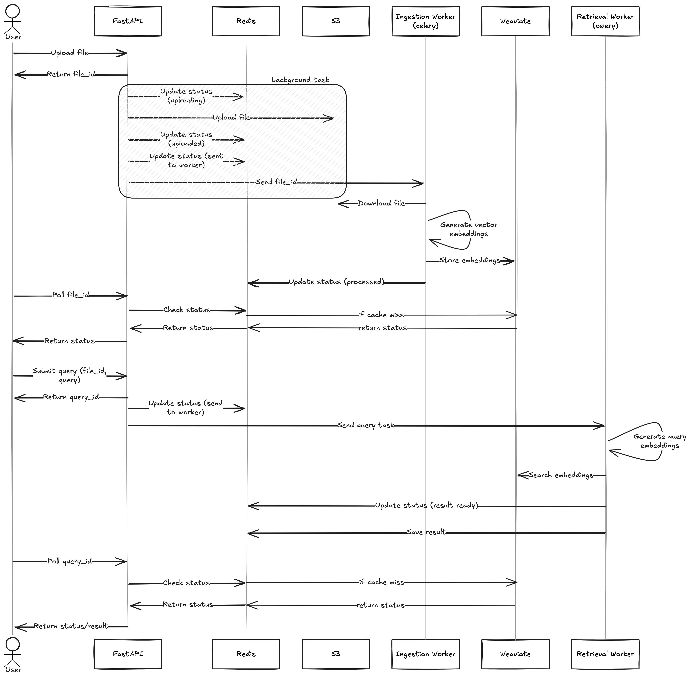

# System Architecture Overview

## Introduction

This document provides a high-level overview of the system architecture for the RAG pipeline, detailing the interaction between the FastAPI server and workers, and the external services used.

## Architecture Components

1. **FastAPI Server**
   - Manages API requests for file uploads, query handling, and status checks.
   - Interfaces with Redis for task queuing and with Weaviate if cache missed.
   - [README](./rag-api/README.md)
2. **Celery Workers**

   - Process uploaded files asynchronously.
   - Generate embeddings and store them in Weaviate.
   - Handle long-running tasks such as query processing.
   - [README](./rag-workers/README.md)

3. **External Services**
   - **Redis**: Acts as a task queue for Celery workers and cache for status.
   - **AWS S3**: Stores uploaded documents.
   - **Weaviate**: Stores and retrieves vector embeddings.

## Workflow

## Technology Stack

- **FastAPI**: REST API framework.
- **Celery**: Task queue for background processing.
- **Redis**: Broker for Celery tasks.
- **AWS S3**: File storage.
- **Weaviate**: Vector database.
- **Docker**: Containerization.
- **EC2**: Running the workers
- **ECS Task**: Running the FastAPI Docker

## Challenges Faced

- New to celery
- Spent too much time on deployment because I later on got to know that these models take too much of space in docker so had to shift and use other models for parsing files

## Future Enhancements

- Add logging and monitoring for better observability.
- More robust and documented code
- More accurate results (currently `json` doesn't give expected output )
